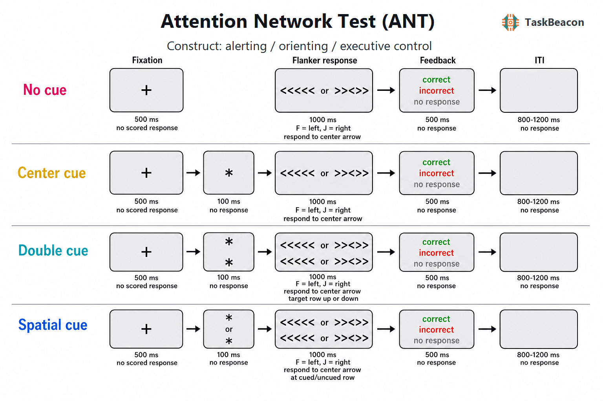

# 注意网络测验：注意子系统的实验分离、神经基础与测量边界

注意包含维持准备状态、选择感觉信息和解决竞争反应等过程。研究这些过程的核心困难在于：若分别采用警觉、空间线索和冲突任务，任务结构差异会妨碍同一被试内的直接比较；若以单一总反应时表征注意，又无法判断性能差异发生于何种加工阶段。注意网络测验（Attention Network Test, ANT）将空间线索范式与侧抑制任务整合在同一速度化选择反应中，以条件间反应时差值分别估计警觉、定向和执行控制效应，从而为注意网络理论提供了可操作的行为测量（Fan et al., 2002）。ANT 通过统一任务中的阶段与对比实现方法学价值；三个差值能否对应彼此独立、具有特质稳定性的心理实体，仍需心理测量证据支持。本文据此讨论其理论来源、标准操作、行为与神经科学证据、主要应用及测量限制，并说明 TaskBeacon 当前实现对经典解释的影响。

## 1. 范式提出与理论背景

ANT 的理论基础来自注意系统的功能分解。Posner 与 Petersen（1990）将注意来源区分为警觉、定向和执行控制系统：警觉涉及达到并维持对即将出现刺激的准备状态；定向涉及从感觉输入中选择位置或对象；执行控制涉及监测并解决刺激—反应竞争。该分类强调功能分工，但并未要求各系统在所有任务条件下统计独立。空间线索研究进一步表明，目标前位置线索可以使注意在不伴随眼动时转移至预期位置，线索有效性效应由感觉增益、脱离和重新定向等过程共同决定（Posner, 1980）。

执行控制操控来自 Eriksen 侧抑制任务。目标两侧干扰项与目标映射到相同反应时，一致条件通常产生较快且更准确的反应；干扰项映射到相反反应时，不一致条件同时增加知觉选择和反应竞争（Eriksen & Eriksen, 1974）。Fan 等（2002）以中央箭头为目标，将其置于四个方向一致、中性或方向不一致的侧翼刺激之间，并在目标前设置无线索、中央线索、双线索和有效空间线索。由此，同一试次同时操控目标出现时间是否被预告、目标位置是否被预告以及侧翼刺激是否引发竞争。该设计使注意网络理论获得统一的实验指标，也使线索与冲突之间的交互成为可检验问题。

## 2. 任务逻辑、流程与核心参数

经典 ANT 的单次试次包含五个连续事件：400–1600 ms 的随机注视期、100 ms 线索、400 ms 线索后注视期、最长 1700 ms 的目标—侧翼阵列以及补足总试次至 4000 ms 的注视期。目标出现在中央注视点上方或下方；被试判断中央箭头朝向，目标出现后作左右键反应。无线索条件在相应的 100 ms 内仅保留注视点；中央线索只提供时间信息；双线索同时出现在两个可能位置，提供时间信息但不预测位置；空间线索始终与目标位置一致，同时提供时间和位置信息。经典程序先进行 24 个带反馈练习试次，再完成 3 个各 96 试次、无逐试次反馈的实验区组（Fan et al., 2002）。

三个网络效应通常以正确试次反应时计算。警觉效应为“无线索反应时－双线索反应时”，两条件均不提供位置预测，因此差值主要表征瞬时警觉和时间准备的获益；定向效应为“中央线索反应时－有效空间线索反应时”，两者均提供时间提示，差值主要表征提前选择目标位置的获益；冲突效应为“不一致反应时－一致反应时”，差值越大表示干扰造成的代价越高（Fan et al., 2002）。准确率、遗漏率和反应时分布可补充平均反应时，尤其用于检查速度—准确率权衡。线索类型与侧翼一致性的交互也应纳入模型，因为线索可能改变感觉准备、反应准备或对冲突刺激的处理时间，单独报告三个边际差值会遗漏这种依赖关系（MacLeod et al., 2010）。

这些差值是任务操作的估计量，不能视为对心理过程的纯测量。无线索与双线索之间除瞬时警觉外，还存在事件预期差异；中央线索与空间线索之间除空间选择外，还可能存在注意范围和运动准备差异；不一致与一致条件之间同时包含知觉冲突、反应竞争和难度差异。ERP 研究进一步显示，线索条件在目标前慢电位以及目标后的早期感觉成分上已有不同，说明目标反应时是多个阶段累积的结果（Galvao-Carmona et al., 2014）。因此，实验报告应保留各条件均值、交互和错误指标，避免只给出三个网络分数。

## 3. 主要行为与神经科学发现

### 3.1 行为效应及网络间作用

经典研究在健康成人中稳定观察到双线索相对于无线索的反应时获益、有效空间线索相对于中央线索的获益，以及不一致相对于一致刺激的反应时与错误代价（Fan et al., 2002）。这些群体均值支持三类操作能够诱发预期效应。原始数据同时出现线索类型与侧翼一致性的交互，后续汇总 15 个数据集的分析也发现网络分数相关及普遍的线索×侧翼交互；ANT 行为数据未能稳健支持“三网络完全独立”（MacLeod et al., 2010）。ANT 在统一任务中生成三个理论上可区分的对比，同时显示警觉和定向状态对冲突加工的调节。

网络效应还受试次时长、线索—目标间隔、目标难度和练习影响。重复测量研究表明，条件均值和群体效应可以持续存在，而个体差值排序仍不稳定；增加会话数量未必能充分改善所有网络分数的信度（Ishigami & Klein, 2010）。这一区分对个体差异研究尤为重要：显著的组内实验效应说明操控有效，不等于该差值适合预测单个被试的临床状态或训练变化。

### 3.2 fMRI 与 EEG/ERP 证据

事件相关功能磁共振成像（functional magnetic resonance imaging, fMRI）显示，三个对比具有可区分但并不孤立的空间分布。警觉对比涉及丘脑及前后部皮层，定向对比涉及顶叶区域和额眼区，冲突对比涉及前扣带皮层及其他控制区域（Fan et al., 2005）。这些结果说明不同任务操作以不同权重招募脑网络；血氧水平依赖（blood-oxygen-level-dependent, BOLD）差异本身不能证明某一区域对相应行为效应具有因果作用。近期重测分析还发现，经典 ANT 的三种 fMRI 差值图在会话间和群体间重叠有限，差值的个体信度低于具体条件估计；一致与不一致条件在部分内在网络中的估计相对更可靠（Kong et al., 2024）。群体激活的可重复性与个体神经指标的稳定性需要分别评价。

脑电图（electroencephalography, EEG）与事件相关电位（event-related potential, ERP）揭示了条件差异的时间进程。高密度 EEG 研究发现，警觉线索后约 200–450 ms 出现 theta、alpha 和 beta 功率下降，空间定向在线索后约 200 ms 伴随 gamma 功率上升；冲突对比则包含目标后早期 gamma 增强、较晚 beta/低 gamma 下降以及反应前后的广谱变化（Fan et al., 2007）。ERP 分析将线索后的随意负变异与预期及感觉—运动准备联系起来，并显示 P1/N1 和 P3 同时受到线索与一致性操控影响；这些成分与单一网络之间不存在专属对应，头皮信号也不足以单独完成精确源定位（Galvao-Carmona et al., 2014）。延长至约 70 分钟的 ANT 研究发现，N100 与 P300 幅度随任务时间下降，但行为结果未呈现完全对应的网络特异性衰减，提示持续注意下降不能由三个静态差值充分解释（Kustubayeva et al., 2022）。

## 4. 范式发展与主要应用

ANT 的主要发展方向是针对人群或研究问题改变刺激、线索和持续时间。儿童版以更易理解的刺激和反馈提高任务可接受性，发展研究显示三个网络具有不同的年龄变化轨迹，尤其是冲突解决在儿童期持续改善（Rueda et al., 2004）。此后形成了引入无效线索或内源线索的版本、将警觉与定向正交化的 ANT-I、增加持续警觉指标的 ANTI-V，以及侧化、听觉和游戏化版本。近年的便携式 AttentionTrip 进一步以移动设备和更具参与性的呈现扩展应用场景，但任何版本替换都需要重新确认对比定义与心理测量性质（de Souza Almeida et al., 2021; Klein et al., 2024）。

临床研究通常将 ANT 用于群体层面的注意表型，其单例诊断能力尚未确立。抑郁研究的贝叶斯元分析提示执行控制效应较健康对照更大，警觉与定向差异缺乏可信证据；纳入研究数量少且任务版本异质，结论仍受样本和参数限制（Sinha et al., 2022）。儿童注意缺陷多动障碍研究的系统综述与元分析发现，总反应时、反应时变异及警觉效应存在组间差异，而定向和执行控制差异不稳定；药物状态、儿童版变体和共病构成是重要异质性来源（Bieleninik et al., 2023）。这些结果支持 ANT 描述群体平均加工差异，但不支持把某一网络分数直接等同于疾病特异性生物标志物。

## 5. 测量效度与解释边界

ANT 具有明确的操作效度：线索、位置预测和侧翼一致性在同一反应规则下产生方向明确的群体效应，且 fMRI 与 EEG 结果与阶段性操控相协调。其构念效度受到减法条件非等价和网络交互的限制。特别是警觉与定向分数均为两个较大反应时均值之差，测量误差会在相减后占据更高比例。15 个健康样本的汇总分析显示，反应时警觉和定向差值的分半信度较低，执行控制差值相对较高；三个分数之间也存在统计依赖（MacLeod et al., 2010）。

近期开放实现的评估进一步表明，反应速度指标总体上比准确率、变异性和随时间下降指标更可靠，同时多种任务存在练习效应（Langner et al., 2023）。因此，研究设计应预先规定有效试次、极端反应时处理、速度—准确率联合检查和条件层级模型；纵向或干预研究还需设置练习对照。临床和发展研究应优先检验组×条件交互，并报告条件均值及其不确定性。差值可用于理论对比，但个体分类、疗效预测或跨版本常模解释需要独立的重测、校准和外部效标证据。

## 6. TaskBeacon 中的任务实现

### 6.1 任务资源与访问入口

| 资源 | ID | 用途 | 地址 |
|---|---|---|---|
| 完整实验实现 | T000015 | 中文行为/EEG 采集版本 | https://github.com/TaskBeacon/T000015-ant |
| 浏览器预览源码 | H000015 | 与 T 版条件语义对齐的缩短行为预览 | https://github.com/TaskBeacon/H000015-ant |

公开元数据可核验 T000015 为 EEG 采集取向的基线版本；H000015 仓库将自身标记为缩短的 HTML/浏览器预览，不能替代完整 EEG 实验。现有一手页面仅给出本地开发运行地址，未能核验可直接访问的公开网页运行入口。

### 6.2 实现流程与关键参数

TaskBeacon 当前版本采用 4 个区组、每区组 96 试次，共 384 试次。条件池包含无线索、中央线索、双线索和空间线索，侧翼仅设一致与不一致两类；目标位于注视点上方或下方，中央箭头向左按 `F`、向右按 `J`。空间线索条件同时包含有效和无效试次，因此经典定向效应应仅用有效空间线索与中央线索比较，无效条件宜另行估计线索有效性成本。该版本不使用自适应控制器。

**图 1. TaskBeacon 当前 ANT 试次流程。** 每次试次先呈现中央注视点 500 ms；无线索条件随后直接进入目标，中央线索在注视点呈现星号 100 ms，双线索在上下位置同时呈现星号 100 ms，空间线索在上方或下方呈现星号 100 ms。五箭头阵列随后呈现至反应或最长 1000 ms；中央箭头决定 `F`/`J` 反应，外围箭头与中央箭头方向相同构成一致条件、方向相反构成不一致条件，阵列可位于已提示或未提示的一行。正确、错误或未反应反馈分别呈现 500 ms，之后为空屏随机试次间隔 800–1200 ms。任务不计积分且不实施自适应调整。

当前实现相较经典 ANT 固定了 500 ms 试次前注视，缩短目标窗口至 1000 ms，删除中性侧翼条件，并在每个实验试次后提供结果反馈。线索后不另设经典程序中的 400 ms 注视期；无线索试次也没有与 100 ms 线索等时的占位阶段，因而无线索目标较有线索目标提前 100 ms 出现。该时序差异会混入警觉对比，且较短线索—目标间隔改变定向准备的时间。研究者据此分析时应保留线索类别、有效性与一致性的完整条件模型，避免未经验证地套用经典常模或将三项差值解释为纯网络效率。

## 参考文献

Bieleninik, Ł., Gradys, G., Dzhambov, A. M., Walczak-Kozłowska, T., Lipowska, K., Łada-Maśko, A., Sitnik-Warchulska, K., Anikiej-Wiczenbach, P., Harciarek, M., & Lipowska, M. (2023). Attention deficit in primary-school-age children with attention deficit hyperactivity disorder measured with the attention network test: A systematic review and meta-analysis. *Frontiers in Neuroscience, 17*, Article 1246490. https://doi.org/10.3389/fnins.2023.1246490

de Souza Almeida, R., Faria-Jr, A., & Klein, R. M. (2021). On the origins and evolution of the Attention Network Tests. *Neuroscience & Biobehavioral Reviews, 126*, 560–572. https://doi.org/10.1016/j.neubiorev.2021.02.028

Eriksen, B. A., & Eriksen, C. W. (1974). Effects of noise letters upon the identification of a target letter in a nonsearch task. *Perception & Psychophysics, 16*(1), 143–149. https://doi.org/10.3758/BF03203267

Fan, J., Byrne, J., Worden, M. S., Guise, K. G., McCandliss, B. D., Fossella, J., & Posner, M. I. (2007). The relation of brain oscillations to attentional networks. *Journal of Neuroscience, 27*(23), 6197–6206. https://doi.org/10.1523/JNEUROSCI.1833-07.2007

Fan, J., McCandliss, B. D., Fossella, J., Flombaum, J. I., & Posner, M. I. (2005). The activation of attentional networks. *NeuroImage, 26*(2), 471–479. https://doi.org/10.1016/j.neuroimage.2005.02.004

Fan, J., McCandliss, B. D., Sommer, T., Raz, A., & Posner, M. I. (2002). Testing the efficiency and independence of attentional networks. *Journal of Cognitive Neuroscience, 14*(3), 340–347. https://doi.org/10.1162/089892902317361886

Galvao-Carmona, A., González-Rosa, J. J., Hidalgo-Muñoz, A. R., Páramo, D., Benítez, M. L., Izquierdo, G., & Vázquez-Marrufo, M. (2014). Disentangling the attention network test: Behavioral, event related potentials, and neural source analyses. *Frontiers in Human Neuroscience, 8*, Article 813. https://doi.org/10.3389/fnhum.2014.00813

Ishigami, Y., & Klein, R. M. (2010). Repeated measurement of the components of attention using two versions of the Attention Network Test (ANT): Stability, isolability, robustness, and reliability. *Journal of Neuroscience Methods, 190*(1), 117–128. https://doi.org/10.1016/j.jneumeth.2010.04.019

Klein, R. M., McCormick, C. R., Almeida, R. de S., Lawen, Z., & Arora, S. (2024). Introducing the portable AttentionTrip: An engaging tool for measuring the networks of attention. *Journal of Neuroscience Methods, 409*, Article 110194. https://doi.org/10.1016/j.jneumeth.2024.110194

Kong, Z., Chen, J., Liu, J., Zhou, Y., Duan, Y., Li, H., & Yang, L.-Z. (2024). Test–retest reliability of the attention network test from the perspective of intrinsic network organization. *European Journal of Neuroscience, 60*(4), 4453–4468. https://doi.org/10.1111/ejn.16448

Kustubayeva, A., Zholdassova, M., Borbassova, G., & Matthews, G. (2022). Temporal changes in ERP amplitudes during sustained performance of the Attention Network Test. *International Journal of Psychophysiology, 182*, 142–158. https://doi.org/10.1016/j.ijpsycho.2022.10.006

Langner, R., Scharnowski, F., Ionta, S., Salmon, C. E. G., Piper, B. J., & Pamplona, G. S. P. (2023). Evaluation of the reliability and validity of computerized tests of attention. *PLOS ONE, 18*(1), Article e0281196. https://doi.org/10.1371/journal.pone.0281196

MacLeod, J. W., Lawrence, M. A., McConnell, M. M., Eskes, G. A., Klein, R. M., & Shore, D. I. (2010). Appraising the ANT: Psychometric and theoretical considerations of the Attention Network Test. *Neuropsychology, 24*(5), 637–651. https://doi.org/10.1037/a0019803

Posner, M. I. (1980). Orienting of attention. *Quarterly Journal of Experimental Psychology, 32*(1), 3–25. https://doi.org/10.1080/00335558008248231

Posner, M. I., & Petersen, S. E. (1990). The attention system of the human brain. *Annual Review of Neuroscience, 13*(1), 25–42. https://doi.org/10.1146/annurev.ne.13.030190.000325

Rueda, M. R., Fan, J., McCandliss, B. D., Halparin, J. D., Gruber, D. B., Lercari, L. P., & Posner, M. I. (2004). Development of attentional networks in childhood. *Neuropsychologia, 42*(8), 1029–1040. https://doi.org/10.1016/j.neuropsychologia.2003.12.012

Sinha, N., Arora, S., Srivastava, P., & Klein, R. M. (2022). What networks of attention are affected by depression? A meta-analysis of studies that used the attention network test. *Journal of Affective Disorders Reports, 8*, Article 100302. https://doi.org/10.1016/j.jadr.2021.100302
